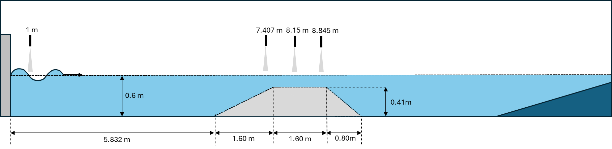

# Wavemodel Benchmark Experiments

This repo includes resulting measurements from a waveflume experiments that was run to provide data of dispersive wave groups for benchmarking wave models.
The wave groups run have steepness spaning from linear to severely breaking conditions. Two bathymetries where used:
1. flat bed (practically deep water)
2. a shoal placed in the center of the flume, giving a depth variation of ~0.9<kh<~3.

A more detail description of the test and the motivation for doing it can be found in

REF JFM paper

The data is provided open access and we ask only that the above journal paper is properly reference in case data usage in other publications.

## Useful information about the dataset
ID tag logics:
C01 = condition 1 (flat bed), C02 = condition 2 (shoal)
A07 = 7mm linear wave amplitude at focus point, A45 = 45mm amplitude, etc. 
F01 = Focus point 1 (which is 8.1m), F02 = Focus point 2(7.1m)
When amplitude increases, strong modulation will occur and the focus point will shift downwave in the the flume. As a result, we moved the linear focus point 1m upwave for the largest condition.

### Flat bed conditions
| ID | File |
| --- | --- |
| C01A07F01 | test370060 |
| C01A25F01 | test470010 |
| C01A45F01 | test470024 |
| C01A65F02 | test470032 |

### Shoal conditions
| ID | File |
| --- | --- |
| C02A07F01 | test430013 |
| C02A25F01 | test430022 |
| C02A45F01 | test430030 |
| C02A65F02 | test430050 |

### Wave probe positions
The wave probe locations were fixed for the entire test.
probe 1: 1.00m from wavemaker
probe 2: 7.407m from wavemaker
probe 3: 8.15m from wavemaker
probe 4: 8.845m from wave maker

### Dissipation tests
The test data from the separate disipation tests can be found in the folder /waveprobes/tank_dissipation_tests. These tests were run with flat seabed (0.6m) and the wave probes were more spread in the basin. The positions of the wave probes for these tests where:
probe 1: 1.0m from wave maker
probe 2: 5.0m from wave maker
probe 3: 8.0m from wave maker
probe 4: 12.0m from wave maker 

### Wave paddle motions
may be found in the folder "wavepaddle_motions". 

### Linear spectral components
Alternatively, discrete linear spectral components may be used to generate the waves.

## Some additional notes
- Only processed PIV data is provided due to github data storage limitations
- The complete dataset includes more waves and a lot of repetitions. Again, due to storage limitations, only the data used in the journal paper is provided here.
